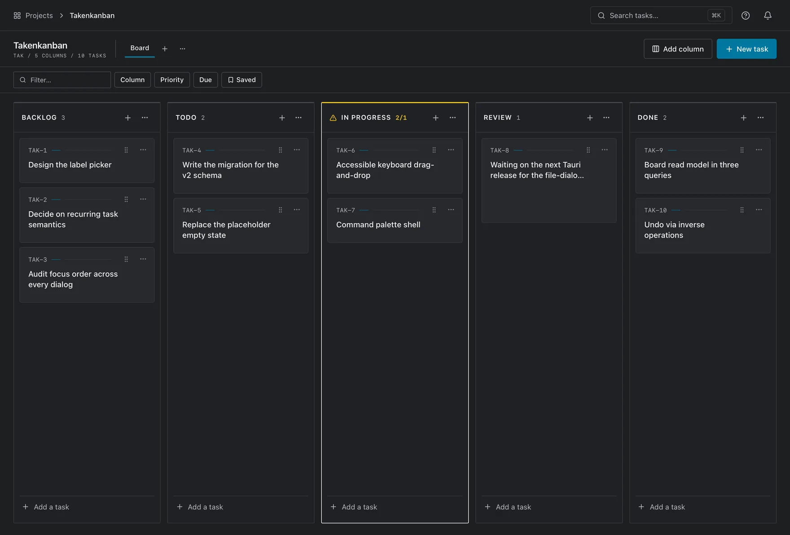
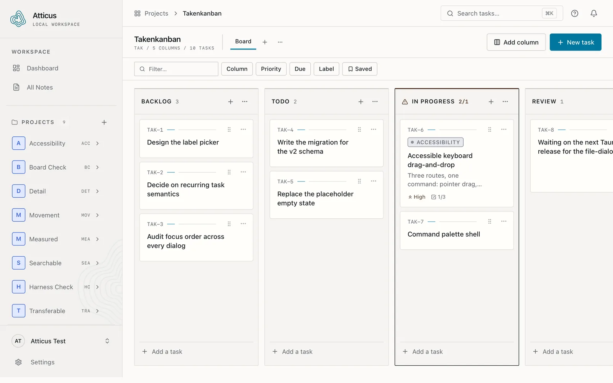
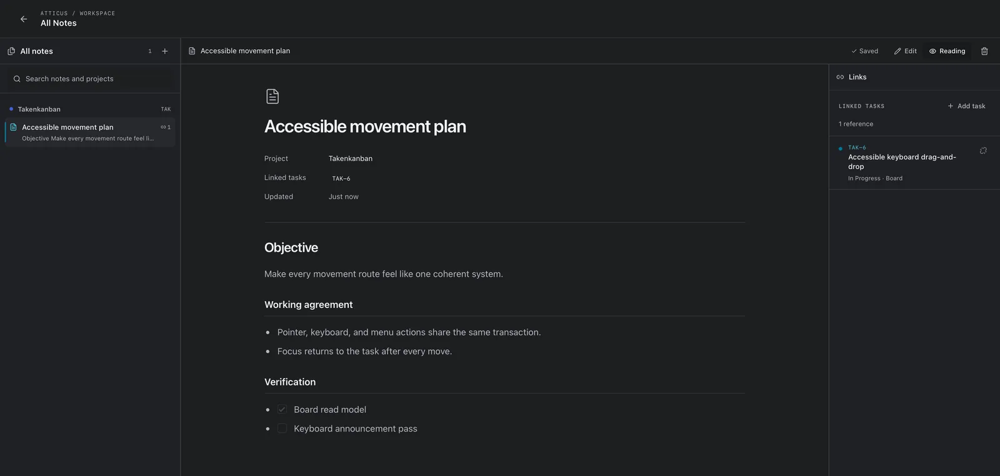
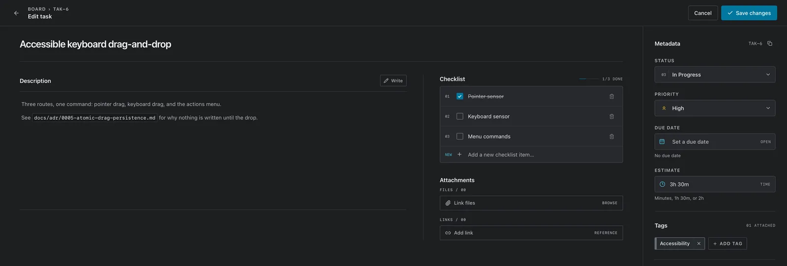
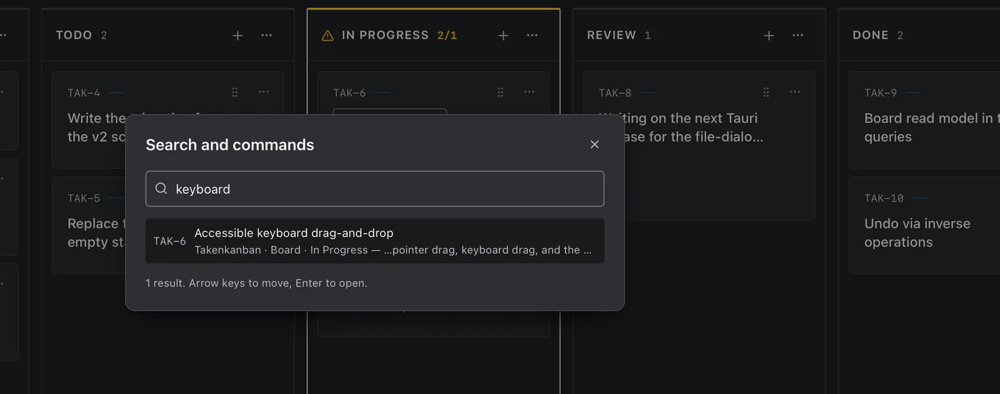

<p align="center">
  
</p>

<h1 align="center">Atticus</h1>

<p align="center">
  <strong>Keep the thread between coding sessions.</strong><br />
  A local-first project desk for one developer running several personal codebases.
</p>

<p align="center">
  <a href="https://github.com/DamienEngelen/Atticus/actions/workflows/publish-updates.yml"></a>
  <a href="#licence"></a>
  <a href="#download"></a>
  <a href="#project-status"></a>
  <a href="#built-with"></a>
</p>

<p align="center">
  <a href="https://damienengelen.github.io/Atticus/"><b>Website</b></a> ·
  <a href="#download"><b>Download</b></a> ·
  <a href="#what-it-does"><b>Features</b></a> ·
  <a href="#local-ai-access-mcp"><b>MCP</b></a> ·
  <a href="docs/"><b>Docs</b></a>
</p>

<p align="center">
  
</p>

---

Three weeks away from a side project and the question is never *what does this code do*. It is
*what was I in the middle of*. Atticus is a desktop application that answers that: boards for
every personal codebase you keep returning to, notes that sit beside the tasks they explain, and
one clear next step waiting where you left it.

It is built for exactly one person — you — and it is honest about that. There are no assignees, no
comments, no activity feed, and nothing to sync. Your work lives in a single SQLite file on your
own disk, and the application tells you exactly where.

**Contents** · [Download](#download) · [What it does](#what-it-does) · [Screens](#screens) ·
[Local AI access](#local-ai-access-mcp) · [Your data](#your-data) · [Project status](#project-status) ·
[Build from source](#build-from-source) · [Documentation](#documentation) ·
[Contributing](#contributing) · [Licence](#licence)

## Download

Builds are published from the moving `main` tag on every push, and a packaged copy follows that
channel with signed automatic updates.

**→ [Latest downloads](https://github.com/DamienEngelen/Atticus/releases/tag/main)**

| Platform | Architecture | File | Notes |
|---|---|---|---|
| macOS 13+ | Apple Silicon | `.dmg` | Open the image, drag Atticus to Applications |
| Linux | x86_64 | `.AppImage` | `chmod +x` it, then run it — portable and self-updating |
| Linux | x86_64 | `.deb` | Debian, Ubuntu, and distributions based on them |

Builds are signed for the updater but **not** notarised by Apple, so the first launch on macOS goes
through *Open Anyway* in **System Settings → Privacy & Security**. After that, Atticus checks for a
newer build at launch and every thirty minutes, downloads it in the background, and offers
**Restart to update** in a header banner. Update payloads are verified against a public key
committed in [`src-tauri/tauri.conf.json`](src-tauri/tauri.conf.json).

Windows is not built. Intel Macs are not verified. See [Project status](#project-status).

## What it does

**Projects and boards.** As many projects as you keep, each with its own boards, your own column
names, and an optional work-in-progress limit per column that says so plainly when you breach it.

**Tasks that hold their context.** A Markdown description, priority, labels, a due date, an
estimate, a subtask checklist, links, and references to real files on your disk. Every task carries
a short human identifier — `TAK-6` — so you can say which one you mean.

**Project notes, linked to the work.** Markdown documents that live with the project and connect to
the tasks they explain. The note names its tasks; each task names its note. Decisions stop
disappearing into commit messages.

**Three ways to move a card.** Pointer drag, keyboard pick-up-and-move, and an explicit *Move to…*
command in the card's actions menu. All three write the same transaction, every move is announced
to screen readers, and `⌘Z` undoes it. Drag is never the only route.

**Finding things again.** `⌘K` searches every project at once and tells you which board and column
each match sits in. Board filters and saved filters narrow one board down.

**Yours to take away.** Versioned JSON export and import, and SQLite backup and restore. A backup is
taken automatically before any schema migration and before any destructive bulk operation, and
restoring backs up the current database first — so a restore is itself reversible.

**Designed to be usable.** Light and dark themes, `prefers-reduced-motion` support, WCAG 2.2 AA as
the accessibility target, and colour contrast asserted by test rather than by eye. Every state
survives greyscale: priority has its own glyph, due dates carry an icon and a label, a breached WIP
limit shows a count and a border change as well as a colour.

Deliberately **not** here: assignees, comments, sharing, sync, mobile, or anything else that implies
a second person. That is a scope decision, not a roadmap — see
[`docs/product-spec.md`](docs/product-spec.md) §3.

## Screens

Every image below is the application as it actually renders, captured by the end-to-end suite.

<table>
  <tr>
    <td width="50%" valign="top">
      <br />
      <b>Light theme, and the project list.</b> Nine codebases, each with its own short code.
    </td>
    <td width="50%" valign="top">
      <br />
      <b>A project note.</b> Markdown, with the task it explains linked beside it.
    </td>
  </tr>
  <tr>
    <td width="50%" valign="top">
      <br />
      <b>The task editor.</b> Description, checklist, files, links, and the metadata rail.
    </td>
    <td width="50%" valign="top">
      <br />
      <b>Search, on <code>⌘K</code>.</b> Every project at once, with the column each match sits in.
    </td>
  </tr>
</table>

## Local AI access (MCP)

Atticus ships a permissioned [Model Context Protocol](https://modelcontextprotocol.io) server inside
the same executable. Codex, Claude, and other stdio clients can read your workspace when you allow
it — and can only write inside a sandbox they created themselves.

```jsonc
{
  "mcpServers": {
    "atticus": {
      "command": "/absolute/path/shown/by/Atticus",
      "args": ["--mcp"]
    }
  }
}
```

Turn it on in **Settings → AI access**, which is where that path is shown. Access is **off** by
default; the modes are *Off*, *Read only*, and *Read & write*.

| Zone | Read | Write |
|---|---|---|
| **Your projects** — everything you made yourself | Permitted once you enable access | **Refused, in every mode** |
| **AI Boards** — projects the server created | Permitted once you enable access | Permitted, inside this zone only |

The boundary is enforced in the database queries, not only in the model's instructions. Knowing the
ID of one of your tasks does not grant write access to it. Archived work is read-only. Delete,
archive, restore, and removal tools are not exposed at all. File references are a separate opt-in,
confined to the project's own folder, and the server never reads a referenced file's contents.

Setup, the tool contracts, and recovery recipes are in [`docs/mcp.md`](docs/mcp.md).

## Your data

```
~/Library/Application Support/nl.synaptica.takenkanban/
  takenkanban.sqlite3        the database
  backups/                   timestamped snapshots
```

The exact path is shown inside the application, so you never have to guess it. It is a plain SQLite
file — `sqlite3` and any SQLite browser will open it.

Set `TAKENKANBAN_DATA_DIR` to move it. That is how you get a second profile, or a copy on an
external disk:

```bash
TAKENKANBAN_DATA_DIR=~/Documents/kanban-work open -a "Atticus"
```

> **Why `takenkanban`?** That was the application's name before it was Atticus. macOS derives the
> data directory from the bundle identifier, so renaming it would leave an existing database
> somewhere the new build does not look. Renaming it is a migration, not a rename, and it has not
> been done.

**Network.** Your project data is never uploaded, synced, or tracked — there is no account and no
server to send it to. The one request a packaged build makes is a signed update check against this
repository's releases. Development builds do not even do that. Backup detail lives in
[`docs/data-and-backups.md`](docs/data-and-backups.md).

## Project status

Atticus is **in development and usable**. Milestones 1–9 are complete and milestone 10 is most of
the way there; nothing in the interface is a placeholder or a dead control. What follows is what is
honestly missing, kept current as work lands.

- **Nobody has yet double-clicked a packaged build from Finder** with the dev server stopped and the
  network off, and worked through a real session. `npm run tauri build` produces a working `.dmg`
  and `npm run release:check` asserts the binary carries no WebDriver server — but until someone has
  sat down with it, "it ships" is a claim rather than a fact.
- **Windows is not built, and Intel Macs are unverified.** Nothing platform-specific has been
  written; nothing has been run there either. Linux x86_64 *is* built and released by CI, but has
  had far less use than macOS.
- **Pointer drag works but has no automated test.** The keyboard and menu routes are covered end to
  end; the mouse gesture is not, because the test driver cannot synthesise a drag `dnd-kit`
  recognises. It is a real gap, not a formality — see [`docs/testing.md`](docs/testing.md).
- **Tab traversal is asserted structurally, not walked.** WKWebView performs no default action for
  the driver's synthetic keys, so focus never moves. Keyboard *reachability* is checked against the
  real document instead — no positive `tabindex`, nothing stranded, one entry point per composite
  widget — which is what makes document order the tab order.
- **Cold launch time is unmeasured.** Every other performance target in
  [`docs/product-spec.md`](docs/product-spec.md) §9 has a real number beside it; this one needs
  timing by hand on a release build, because the test harness's own window probes dwarf it.
- **Task descriptions render a restricted subset of Markdown.** No raw HTML, no remote images, and
  links open in your browser rather than inside the app. Deliberate, not an omission.
- **File references store paths, not copies.** Move a referenced file and the link breaks — by
  design, and the application shows a clear "missing" state rather than pretending otherwise. See
  [ADR-0007](docs/adr/0007-local-file-references.md).
- **System file dialogs are not covered by an automated test.** They are native windows the
  WebDriver session cannot reach, so the export and import specs call the commands with a path
  directly. Everything either side of the dialog is covered end to end.

Toolchain-level constraints — pinned dependency majors, the two overrides in force, and why the E2E
suite uses WebdriverIO rather than Playwright — are recorded in
[CONTRIBUTING.md](CONTRIBUTING.md#known-constraints).

## Build from source

```bash
git clone https://github.com/DamienEngelen/Atticus.git
cd Atticus
npm install
npm run tauri dev
```

You will need Node.js `^20.19.0 || >=22.12.0`, a stable Rust toolchain, and the Xcode Command Line
Tools on macOS. Everything else — the quality gate, the end-to-end harness, packaging, and the
release workflow — is in [CONTRIBUTING.md](CONTRIBUTING.md).

### Built with

[Tauri 2](https://tauri.app) for the desktop shell and the Rust core, [React
19](https://react.dev) and TypeScript for the interface, [SQLite](https://sqlite.org) (via
`rusqlite`) for storage, [Radix Colors](https://www.radix-ui.com/colors) for the palette,
[dnd-kit](https://dndkit.com) for movement, and [Lucide](https://lucide.dev) for icons. Type
bindings are generated from the Rust types rather than written twice. Full dependency list and
licences: [THIRD_PARTY_NOTICES.md](THIRD_PARTY_NOTICES.md).

## Documentation

| Document | What it covers |
|---|---|
| [`docs/product-spec.md`](docs/product-spec.md) | Target user, user stories, acceptance criteria, edge cases, non-goals |
| [`docs/architecture.md`](docs/architecture.md) | Boundaries, schema, commands, transactions, security posture |
| [`docs/mcp.md`](docs/mcp.md) | Local AI access, permissions, workflow rules, and MCP tools |
| [`docs/shortcuts.md`](docs/shortcuts.md) | Every keyboard route, and the ones that do not exist yet |
| [`docs/data-and-backups.md`](docs/data-and-backups.md) | Where data lives, how backups are taken, how to restore |
| [`docs/design-decisions.md`](docs/design-decisions.md) | The visual directions, and why "Ledger" was chosen |
| [`docs/testing.md`](docs/testing.md) | What each test layer may honestly claim, and how to run it |
| [`docs/visual-review.md`](docs/visual-review.md) | States rendered and looked at, with defects found |
| [`docs/milestones.md`](docs/milestones.md) | The milestones and their acceptance criteria |
| [`docs/research.md`](docs/research.md) | Every source consulted, with URLs, dates, and what was rejected |
| [`docs/adr/`](docs/adr/) | Decision records for choices that are expensive to reverse |

## Contributing

Issues and pull requests are welcome. Atticus is a single-user application by design, so the most
useful contributions are bug reports from real use, accessibility findings, and Linux or Windows
build reports — the platforms with the least mileage on them.

Before opening a pull request, please read [CONTRIBUTING.md](CONTRIBUTING.md): it covers the
development setup, the single quality gate (`npm run verify`, which must be green), and the one
house rule that matters — **a failing check is reported, not carried**.

Found a security issue? Open a private
[security advisory](https://github.com/DamienEngelen/Atticus/security/advisories/new) rather than a
public issue.

## Licence

[MIT](LICENSE). Third-party licences are recorded in
[THIRD_PARTY_NOTICES.md](THIRD_PARTY_NOTICES.md).
